# CI Scripts

This folder contains reusable PowerShell scripts and helpers for our Azure Pipelines builds.
They are **cross‑platform** (Windows / Linux / macOS) and compatible with **PowerShell 5.1+ and 7+**.

---

## Files

### `common.ps1`

Central helper library dot‑sourced by all other scripts.

**Provides:**

- `Get-OS` – Detects current OS.
- `Add-Path` – Prepends a directory to `PATH` for the current pipeline/job.
- `Ensure-BrewOnPath` – Ensures Homebrew paths are in `PATH` for macOS/Linux.
- `Invoke-WebContent` – Safe web content fetcher (works in PS5 and PS7).
- `Ensure-PackageManagers` – Installs or ensures Scoop (Windows) / Brew (POSIX).
- `Ensure-Mise` – Installs mise via Scoop or Brew and adds shims to `PATH`.
- `Gradle-Wrapper` – Runs `gradlew` or `gradlew.bat` if present.

---

### `setup-mise-java.ps1`

Sets up **Java** via [mise](https://mise.jdx.dev/) with guardrails and audit signals.

**What it does:**

1. Dot‑sources `common.ps1` helpers.
2. Sets `MISE_DATA_DIR` and `MISE_CACHE_DIR` for the unified cache step in the pipeline.
3. Ensures package managers and installs mise.
4. Reads the Java pin from `mise.toml`.
5. Installs Java and validates:
   - Pin drift (current version matches `mise.toml`).
   - Active `java` on PATH matches mise’s.
   - `JAVA_HOME` and JVM’s `java.home` agree.
   - Version contains the pinned major.
6. **Audit output**:
   - Lists all `java` binaries found on `PATH`.
   - Shows the JDK Gradle will use (`gradlew -version`).

**Run locally:**

```powershell
pwsh ./ci/setup-mise-java.ps1
```

---

### `gradle-build.ps1`

Runs the main Gradle build.

**What it does:**

- Dot‑sources `common.ps1` for `Gradle-Wrapper`.
- Calls `gradlew build`.

**Run locally:**

```powershell
pwsh ./ci/gradle-build.ps1
```

---

### `gradle-stop.ps1`

Stops the Gradle daemon after builds.

**What it does:**

- Dot‑sources `common.ps1` for `Gradle-Wrapper`.
- Calls `gradlew --stop` if wrapper exists.

**Run locally:**

```powershell
pwsh ./ci/gradle-stop.ps1
```

---

## Pipeline Wiring

Typical Azure Pipelines YAML usage:

```yaml
- task: Cache@2
  displayName: mise cache
  inputs:
    key: mise | $(Agent.OS) | $(Agent.OSArchitecture) | $(Build.SourcesDirectory)/mise.toml
    path: |
      $(MISE_DATA_DIR)
      $(MISE_CACHE_DIR)

- task: PowerShell@2
  displayName: Setup runtimes via mise and verify
  inputs:
    filePath: $(Build.SourcesDirectory)/ci/setup-mise-java.ps1
    pwsh: true

- task: PowerShell@2
  displayName: Gradle build
  inputs:
    filePath: $(Build.SourcesDirectory)/ci/gradle-build.ps1
    pwsh: true
  env:
    JAVA_HOME: $(JAVA_HOME)

- task: PowerShell@2
  displayName: Stop Gradle daemon
  inputs:
    filePath: $(Build.SourcesDirectory)/ci/gradle-stop.ps1
    pwsh: true
```

---

## Visual Flow

```mermaid
flowchart LR
    subgraph Common["ci/common.ps1"]
        A1[Get-OS]
        A2[Add-Path]
        A3[Ensure-BrewOnPath]
        A4[Invoke-WebContent]
        A5[Ensure-PackageManagers]
        A6[Ensure-Mise]
        A7[Gradle-Wrapper]
    end

    subgraph Setup["ci/setup-mise-java.ps1"]
        B1[Set MISE_DATA_DIR / MISE_CACHE_DIR vars]
        B2[Get-MisePinVersion]
        B3[Install-Java-And-Guard]
        B4[Audit: All java binaries]
        B5[Audit: Gradle sees JDK]
    end

    subgraph Build["ci/gradle-build.ps1"]
        C1[Gradle-Wrapper build]
    end

    subgraph Stop["ci/gradle-stop.ps1"]
        D1[Gradle-Wrapper --stop]
    end

    Common --> Setup
    Common --> Build
    Setup --> Build
    Build --> Stop
```



---

## Timeline & Data Flow


---

## Notes for Contributors

- No inline script duplication — all helpers live in `common.ps1`.
- Keep `mise.toml` in repo root as the single source of truth for Java version.
- Scripts are self‑auditing — read the log output for PATH changes, Java binaries, and Gradle’s JDK.
- You can run these scripts locally before pushing changes to test the exact pipeline logic.

---

## Troubleshooting

Below are common hiccups you might see when running these scripts locally or in the pipeline, and how to fix them fast.

| Symptom | Likely Cause | Quick Fix |
| :--- | :--- | :--- |
| `brew not found` on macOS/Linux | Homebrew isn’t installed or not on `PATH` | Install Homebrew locally, or ensure `/opt/homebrew/bin` or `/home/linuxbrew/.linuxbrew/bin` is on `PATH`. The `Ensure-BrewOnPath` helper already tries — make sure it’s being run. |
| `scoop not found` on Windows | Scoop not installed | The setup script should bootstrap it, but if running locally, install from scoop.sh. |
| `mise command not found` | `mise` not installed or `PATH` not updated | Rerun setup script; verify `$HOME/.local/share/mise/shims` is in `PATH`. |
| Pin drift error (expected X, got Y) | Your `mise.toml` Java pin doesn’t match the installed version | Run `mise install` locally after updating `mise.toml`, or update the pin to match the intended Java version. |
| `JAVA_HOME` mismatch with JVM `java.home` | Another JDK/JRE is shadowing mise’s Java | Check `Get-Command -All java` to locate duplicates; adjust `PATH` so mise’s `bin` comes first. |
| Gradle build using wrong JDK | `JAVA_HOME` not set in environment | Confirm the setup script runs before any Gradle task in pipeline; locally, export `JAVA_HOME` before invoking `gradlew`. |
| `gradlew not found` | No Gradle wrapper in repo root | Add one (`gradle wrapper`), or adjust scripts to point to its actual location. |
| Cache step skipped or empty | `MISE_DATA_DIR` / `MISE_CACHE_DIR` not set in prior step | Ensure setup script runs before `Cache@2` in pipelines, or set vars manually. |

### Debugging Tips

- **Run locally first**: Use `pwsh ./ci/setup-mise-java.ps1` to reproduce pipeline setup.
- **Verbose logging**: Temporarily add `Write-Host` calls to echo `PATH` and key env vars.
- **Inspect `PATH` order**: On mac/Linux, `echo $PATH` — on PS, `$env:PATH -split ';'`.
- **Clear caches**: Delete local `~/.cache/mise` or `%UserProfile%\.cache\mise` to force fresh installs.
- **Self‑hosted agent testing**: The scripts work identically on a self‑hosted agent — great for reproducing CI issues.

---

## Common Local Test Commands

These commands let you verify the most common setup and audit steps locally, on any OS, using the same logic our pipeline runs.

| Goal | Command | What to Look For |
| :--- | :--- | :--- |
| Detect OS as script sees it | `pwsh -NoLogo -Command ". ./ci/common.ps1; Get-OS"` | Should output `Windows`, `Mac`, or `Linux`. |
| Ensure package managers available | `pwsh -NoLogo -Command ". ./ci/common.ps1; Ensure-PackageManagers (Get-OS)"` | Should either install or confirm `brew`/`scoop` is ready. |
| Ensure mise installed & on `PATH` | `pwsh -NoLogo -Command ". ./ci/common.ps1; Ensure-Mise (Get-OS)"` | Should print `mise` version. |
| Show Java pin from `mise.toml` | `pwsh -NoLogo -Command ". ./ci/setup-mise-java.ps1; Get-MisePinVersion"` | Outputs the pinned Java version string. |
| Run full setup with audits | `pwsh ./ci/setup-mise-java.ps1` | Look for guards passing and the `=== Audit: All java binaries on PATH ===` section. |
| Check Gradle wrapper detection | `pwsh -NoLogo -Command ". ./ci/common.ps1; Gradle-Wrapper '-version'"` | Should print Gradle + Java version if wrapper exists. |
| Stop Gradle daemon | `pwsh ./ci/gradle-stop.ps1` | Should say “Stopping Gradle daemon…” or skip gracefully if wrapper missing. |

### Quick Tips

- Run from repo root so relative paths to `ci/*.ps1` work.
- Use `-Verbose` on any script call to see more internal output if you’ve added verbose logs.
- If something fails locally but works in CI, compare `Get-OS` + `PATH` output between environments.

---
